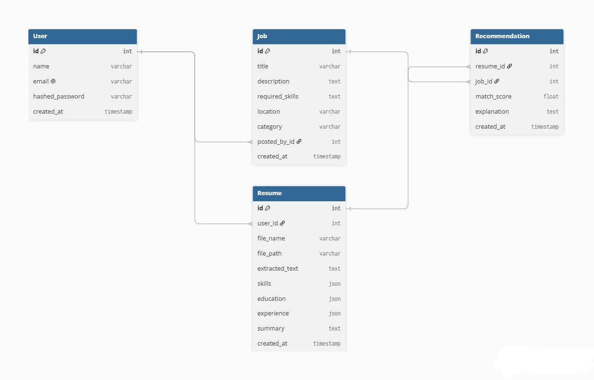
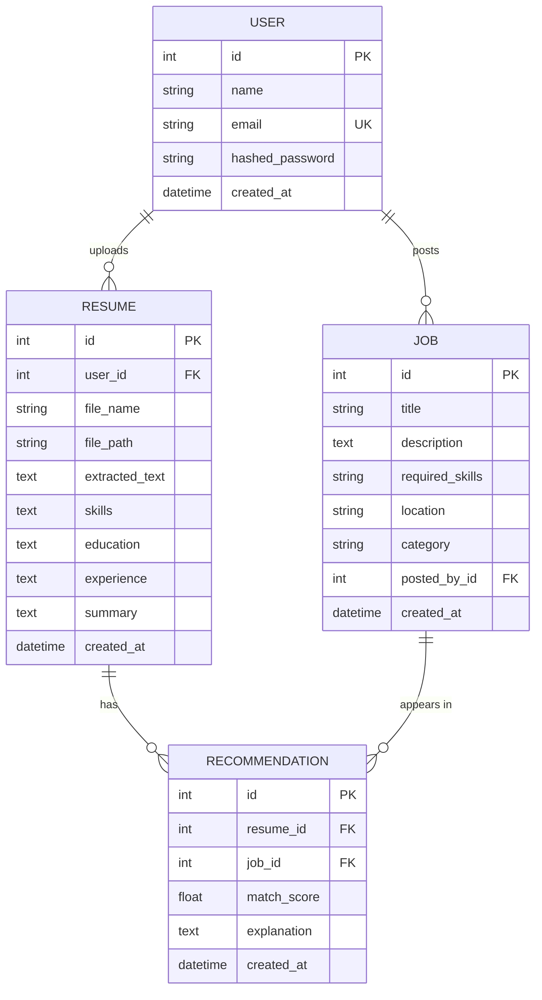

# ER Diagram — AI Resume Analyzer

## Mermaid source (renders on GitHub, VS Code, most Markdown viewers)

## Notes on design decisions

- **`skills`, `education`, `experience` are stored as JSON text** inside `Resume` rather than separate normalized tables. This was a deliberate trade-off given the SQLite constraint and project timeline — these fields are read as a whole (never queried by individual skill at the SQL level), so JSON-in-a-text-column avoids unnecessary join complexity. The trade-off is documented here as a conscious decision, not an oversight.
- **`Recommendation` is a resolved (materialized) table**, not a pure many-to-many join — it stores the *result* of the Job Matching Agent (score + explanation) rather than just linking `Resume` and `Job`. This lets the API return saved matches instantly without recomputing embeddings every time.
- **Cascade delete**: deleting a `Resume` also deletes its `Recommendation` rows (`cascade="all, delete-orphan"` in `models.py`), so no orphaned matches are left behind.
- **`required_skills` is a comma-separated string, not a separate `Skill` table.** For the scale of this project (a student-built job board, not a production ATS), a normalized many-to-many `Job_Skill` table would add real complexity (extra joins, skill deduplication/normalization logic) for very little practical benefit — the RAG-based matching in `job_matching_agent.py` works on the free-text skill string directly via embeddings, so it doesn't need the skills to be normalized rows. This is called out here as a scoping decision worth mentioning if asked in the discussion/defense.
